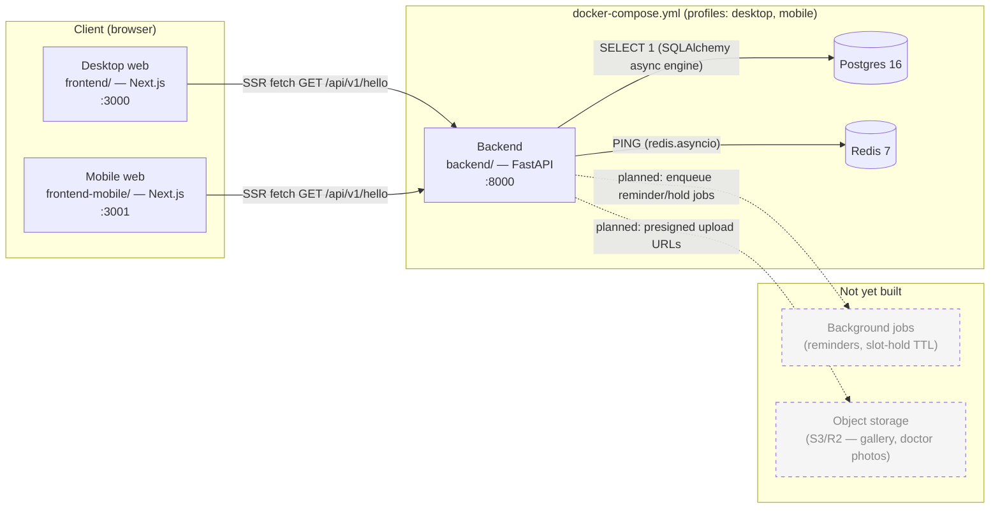
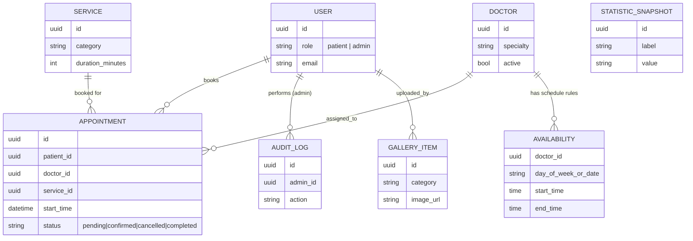

# Architecture — as of 2026-08-16

Partially built. The runtime shape (two frontends, one backend, Postgres, Redis, all wired through `docker-compose.yml`) is real and running — but the backend is currently just three infrastructure endpoints (`/health`, `/api/v1/hello`, `/api/v1/status`); no domain routes, no data model, no auth, no background jobs, and no object storage exist in code yet, despite all being planned in `mvp.md`. Nodes below marked **(planned)** are dashed and reflect `mvp.md`, not implemented code — see `todo.md` for the full built-vs-planned breakdown.

## System overview

`/api/v1/status` is the only route that actually talks to Postgres/Redis today — it's a readiness probe, not a data endpoint. Desktop additionally has an `admin/` route tree (see `frontend/src/app/admin/`) with no backend counterpart yet — those pages are static stubs with no API calls.

## Data model

Not implemented in code — `backend/app/main.py` has no SQLAlchemy models, only a raw `create_async_engine` used for the `/api/v1/status` connectivity check. The diagram below is `mvp.md §6`'s planned schema, included per that confirmation, not because it exists yet.

---
Reflects commit: 7d5577dfa0d002b1bd5a52e441c82981d23e6557
