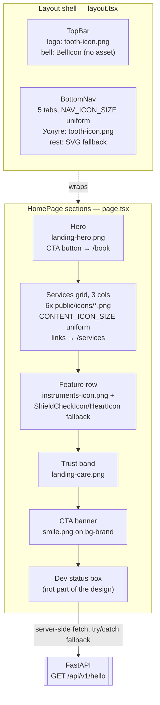

# Feature: mobile landing page

The mobile app's home page (`frontend-mobile/src/app/page.tsx`) composed under the shared layout shell (`layout.tsx` → `TopBar` + `BottomNav`), built around real illustration/icon assets copied from `frontend/photos/` into `frontend-mobile/public/`. Icon sizing is enforced structurally via two shared constants (`CONTENT_ICON_SIZE`, `NAV_ICON_SIZE` in `components/icons.tsx`) rather than per-instance classes, so real PNG icons and the hand-drawn SVG fallbacks (kept only where no matching asset exists — bell, calendar, home, gallery, profile, shield, heart) render at one consistent size each. The page's only runtime dependency is a single server-side fetch to the backend's hello-world endpoint, rendered as a dev-only status box unrelated to the visual design.

---
Last updated: 2026-08-16, reflects commit 7d5577dfa0d002b1bd5a52e441c82981d23e6557
